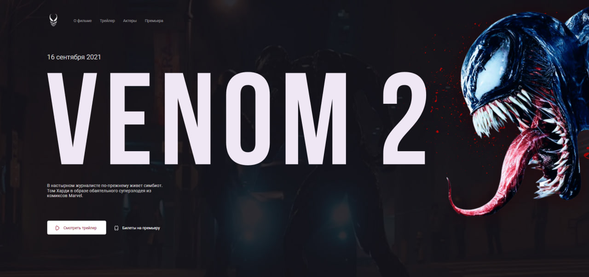
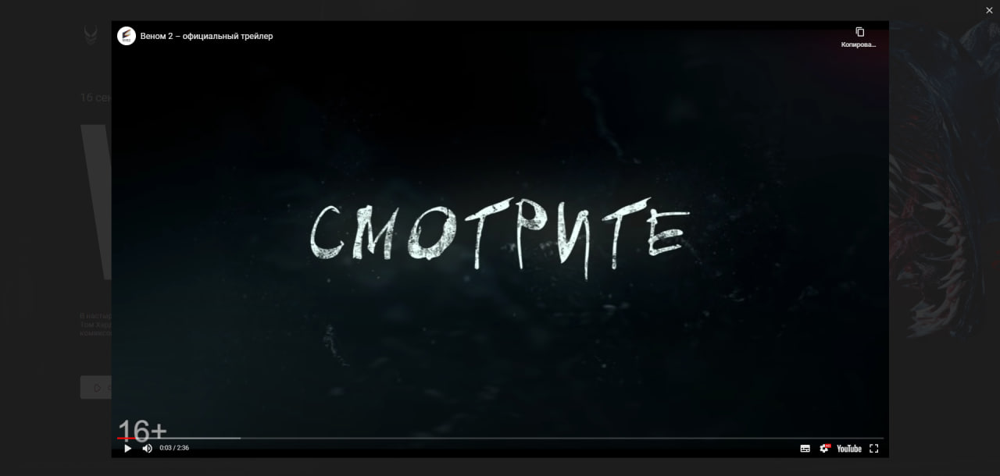
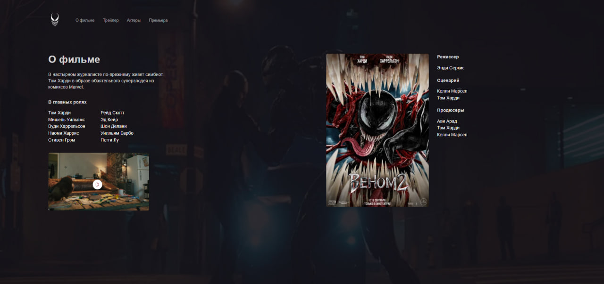
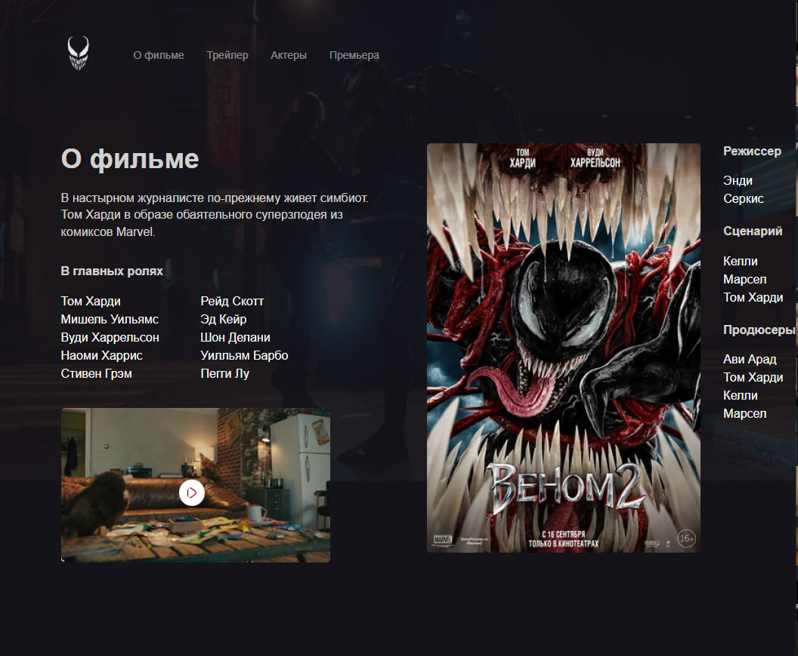
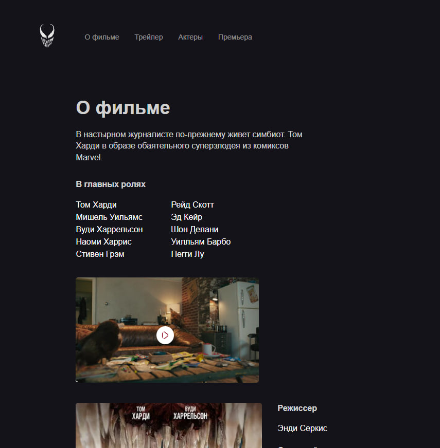

# Venom 2 Website Project

This repository contains the source code for a website about the movie *Venom 2*. The site is built with HTML and CSS, and it includes a responsive layout and interactive elements.

## Features

- **Home page**: Main page with introductory information about *Venom 2*.
- **About page**: Details about the movie, including plot summary and cast.
- **Responsive design**: Adapts to different screen sizes for desktop, tablet, and mobile views.
- **Embedded trailer**: YouTube video trailer integrated into the site.

## Files

1. **`index.html`**: Homepage.
2. **`about.html`**: Page with movie details.
3. **`styles.css`**: CSS for styling and layout.
4. **`normalize.css`**: CSS to normalize browser styles.
5. **`main.js`**: JavaScript for interactive features.

## JavaScript Functionality

- **Menu Toggle**: The `main.js` file enables the navigation menu to open and close when the corresponding buttons are clicked.

## How to View

1. **Clone the Repository**:
    ```bash
    git clone https://github.com/yokkochka/Venom.git
    ```

2. **Go to the Project Directory**:
    ```bash
    cd Venom
    ```

3. **Open `index.html`**:
    Open the `index.html` file in a web browser to view the homepage. To view the movie details page, open `about.html`.

## Technologies

- **HTML**: For webpage structure.
- **CSS**: For styling and responsive design.
- **JavaScript**: For interactive elements.

## Screenshots

### Home Page



### Trailer Section



### About Page



### Fluid layout




